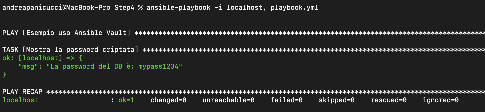

# Step 4 - Uso di Ansible Vault

## Descrizione

In questo esercizio si dimostra come usare **Ansible Vault** per criptare una variabile contenente una password (`db_password`) e utilizzarla in un playbook senza esporla in chiaro.

---

## File utilizzati

- `Step4/vars.yml`  
  File YAML contenente la variabile `db_password` criptata tramite Ansible Vault.

- Playbook Ansible  
  Un semplice playbook che importa `vars.yml` e mostra tramite un task `debug` il valore della password (decriptata automaticamente durante l’esecuzione).

---

## Dettagli dell’esercizio

### 1. Creazione del file criptato

La variabile `db_password` è stata inserita nel file `vars.yml` e criptata con Ansible Vault, quindi nel file appare una stringa cifrata

## Conclusione

L’utilizzo di **Ansible Vault** rappresenta una soluzione semplice ed efficace per proteggere le informazioni sensibili nei tuoi progetti Ansible. Cifrando le password e le credenziali, si riduce notevolmente il rischio di esposizione accidentale di dati riservati nel codice sorgente o nei repository.

Integrare Vault nei playbook permette di mantenere la sicurezza senza rinunciare alla facilità di gestione e automazione, garantendo così un ambiente più sicuro e professionale.

---

## Esecuzione playbook `ansible-playbook -i localhost, playbook.yml`

